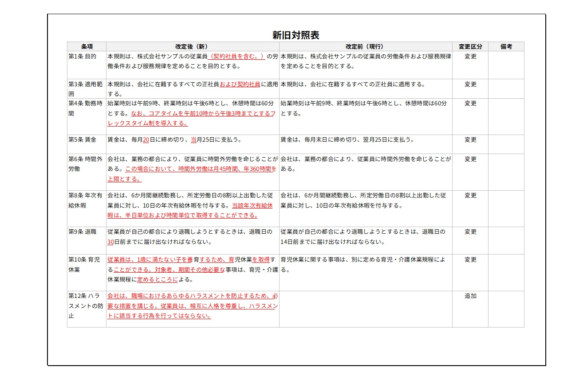
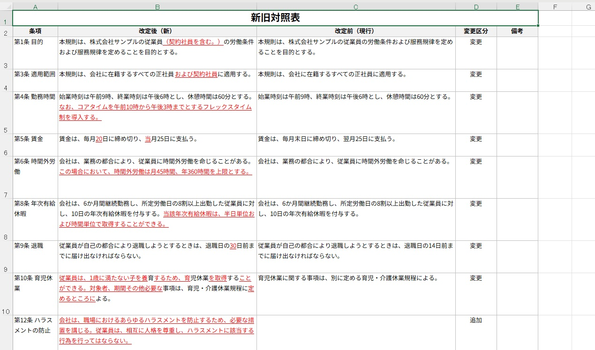

# policy-comparison-table

[](LICENSE)
[](https://nodejs.org/)
[](tsconfig.json)
[](CONTRIBUTING.md)

> **Generate Excel before-after comparison tables from two versions of a policy,
> contract, manual, specification, or business document.**

A small local CLI that compares two versions of a document and exports the
differences as a **before-after comparison table** you can open in Excel or
Google Sheets.

This is **not** just a raw diff viewer. Instead of line-by-line `+`/`-` output,
it produces a structured table — one row per section — with the before text,
the after text, a change type, and a short summary. That format is what people
actually use for policy revisions, contract reviews, and document change logs.

Everything runs **locally on your own machine**. Your documents are never
uploaded anywhere. There is no server, no account, and no cloud storage.

📖 日本語の詳しい使い方は **[docs/manual-ja.md](docs/manual-ja.md)** を参照してください。

## Screenshot

A generated **A4-landscape before-after comparison table** — the form you hand
to reviewers and approvers (added text is highlighted in red + underline):



The same table opened in **Excel** — fully editable, ready to print or share:



## Table of contents

- [Use cases](#use-cases)
- [Privacy & local-only](#privacy--local-only)
- [Why not just a diff?](#why-not-just-a-diff)
- [How it works](#how-it-works)
- [Install](#install)
- [Usage](#usage)
- [Click-to-run scripts (no terminal)](#click-to-run-scripts-no-terminal)
- [Output columns](#output-columns)
- [Example output](#example-output)
- [Supported formats](#supported-formats)
- [Documentation](#documentation)
- [Roadmap](#roadmap)
- [Contributing](#contributing)
- [License](#license)

## Privacy & local-only

This tool is designed for sensitive documents (policies, contracts, internal
rules), so privacy is a core constraint, not an afterthought:

- **No uploads.** Files are read from and written to your local disk only.
- **No network calls at runtime.** There is no server, API, account, or
  telemetry. `.docx` parsing and `.xlsx` writing happen entirely on-device.
- **No cloud, no database.** Nothing is stored outside the folders you choose.

You can run it fully offline.

## Use cases

For maintainers, and for legal / HR / compliance / operations staff who prepare
revision documents for review and approval:

- Policy and internal-rule revisions
- Employee handbooks and manuals
- Contracts and specifications
- README / documentation updates
- General business documents

The concept is inspired by the Japanese **新旧対照表 (shinkyū taishōhyō,
"old-vs-new comparison table")**, a standard format in regulatory and corporate
revision work — but it is not limited to Japanese documents.

## Why not just a diff?

A line-level diff (`+`/`-`) tells you what bytes changed. Document revision work needs something different: a clause-by-clause table showing the old text, the new text, and the type of change — ready to paste into an approval request, board paper, or review document. This tool produces that table and exports it to Excel, where reviewers and approvers actually work.

| Tool | Output | Best for |
|---|---|---|
| `git diff` / diff viewers | Line-level `+` / `-` output | Source-code review |
| `policy-comparison-table` | Section-level before-after table (CSV / Markdown / Excel) | Policy, contract, manual, and specification revisions |

## How it works

1. Read the *before* and *after* files (`.txt`, `.md`, or `.docx`).
2. Split each document into practical comparison blocks (by headings,
   `第1条` / `Article 1` style sections, numbered headings, or paragraphs).
3. Match the blocks and compare their text.
4. Classify each row as **unchanged**, **modified**, **added**, or **removed**.
5. Export the result as a CSV, Markdown, or Excel before-after comparison table.

## Install

Requires Node.js 18+.

```bash
git clone https://github.com/hikaru1x7/policy-comparison-table.git
cd policy-comparison-table
npm install
npm run build
```

You can then run the built CLI:

```bash
node dist/index.js before.md after.md
```

Or link it globally to use the `policy-comparison-table` command:

```bash
npm link
policy-comparison-table before.md after.md
```

## Usage

For a Japanese-style Excel before-after comparison table:

```bash
policy-comparison-table before.docx after.docx --locale ja --changed-only --format xlsx --output comparison.xlsx
```

This generates an editable Excel comparison table with Japanese column labels.

### Options

| Option | Description |
|---|---|
| `--format <csv\|markdown\|xlsx>` | Output format. Default: `markdown`. |
| `--output <file>` | Write to a file instead of stdout. Required for `xlsx`. |
| `--locale <en\|ja>` | Column and label language. Default: `en`. |
| `--changed-only` | Exclude unchanged rows. |
| `--preset ja-policy` | Shortcut for `--locale ja --changed-only --format csv`. Writes `comparison.csv` unless `--output` is given. |
| `-h`, `--help` | Show help. |

### Examples

```bash
# Print a Markdown comparison table to the terminal
policy-comparison-table before.txt after.txt

# Export a CSV for Excel / Google Sheets
policy-comparison-table before.txt after.txt --format csv --output comparison.csv

# Export a Markdown table to a file
policy-comparison-table before.txt after.txt --format markdown --output comparison.md

# Japanese columns, changed rows only, CSV
policy-comparison-table before.txt after.txt --locale ja --changed-only --format csv --output comparison.csv

# Same as above, via the preset
policy-comparison-table before.txt after.txt --preset ja-policy

# Compare two Word documents (.docx)
policy-comparison-table before.docx after.docx --preset ja-policy

# A4-landscape Excel "before-after" form (changed rows only)
policy-comparison-table before.docx after.docx --locale ja --changed-only --format xlsx --output comparison.xlsx
```

## Click-to-run scripts (no terminal)

Ready-made launcher scripts live in [`examples/`](examples/):
`run_comparison.ps1` + `run_comparison.bat` (Windows) and `run_comparison.sh`
(macOS / Linux).

Typical workflow:

1. Copy the script(s) into the **same folder as your before/after files**.
2. Open the script in a text editor and set the file names at the top —
   `$Before` / `$After` / `$Output` (PowerShell) or `BEFORE` / `AFTER` /
   `OUTPUT` (shell).
3. Run it: **double-click `run_comparison.bat`** on Windows, or run
   `bash run_comparison.sh` on macOS / Linux.

Inside the script, set the `$Node` / `$Tool` (PowerShell) or `TOOL` (shell)
paths to point at your Node.js and this tool's `dist/index.js`. The `.ps1` is
saved as UTF-8 with BOM so Japanese file names are not garbled on Windows
PowerShell.

## Output columns

**English (default)**

English columns:

`Section`, `Before`, `After`, `Change Type`, `Summary`, `Notes`

Japanese columns:

`条項`, `改定前`, `改定後`, `変更区分`, `変更内容`, `備考`

Change types are reported as `unchanged` / `modified` / `added` / `removed`
(English) or `変更なし` / `変更` / `追加` / `削除` (Japanese).

## Example output

### English

| Section | Before | After | Change Type | Summary | Notes |
|---|---|---|---|---|---|
| Section 1 Purpose | ...all full-time employees. | ...all full-time and part-time employees. | modified | Text modified. |  |
| Section 4 Equipment | ...internet connection is the employee's responsibility. | ...reimburses internet costs up to 3,000 yen per month. | modified | Text modified. |  |
| Section 5 Security |  | ...must use the company VPN... | added | Section added. |  |
| Section 5 Termination | ...revoke remote work arrangements at any time. |  | removed | Section removed. |  |

### Japanese

| 条項 | 改定前 | 改定後 | 変更区分 | 変更内容 | 備考 |
|---|---|---|---|---|---|
| 第1条 目的 | ...適用対象は正社員とする。 | ...適用対象は正社員および契約社員とする。 | 変更 | 文言を変更 |  |
| 第5条 情報セキュリティ |  | ...会社が指定するVPNを利用し... | 追加 | 条項を追加 |  |
| 第5条 解除 | ...在宅勤務をいつでも解除することができる。 |  | 削除 | 条項を削除 |  |

Full example inputs and outputs live in [`examples/`](examples/).

## Supported formats

| | Format |
| --- | --- |
| **Input** | Plain text (`.txt`), Markdown (`.md`), Word (`.docx`) |
| **Output** | CSV, Markdown table, Excel (`.xlsx`) |

CSV output is written as UTF-8 with a BOM (for reliable Excel detection),
quotes fields that contain commas, quotes, or line breaks, and preserves long
multi-line cell text.

`.docx` files are read locally via [mammoth](https://www.npmjs.com/package/mammoth);
the text is extracted and split using the same rules as Markdown. Documents that
use heading text such as `第1条` or `Article 1` compare best. Images, tables, and
complex formatting are ignored.

### Excel form (`--format xlsx`)

`--format xlsx` produces a print-ready **before-after comparison form**
(requires `--output`):

- Fixed to **A4 landscape**; long documents flow onto more pages automatically.
- A title (`新旧対照表` / "Before-After Comparison Table") **centered across the
  full table width**.
- The title and the column headers are set as **print title rows**, so they
  repeat at the top of every printed page (page 2 onward included).
- Columns are ordered **left = after (new), right = before (current)**.
- **Only added text is emphasized** (red + underline). Removed / before-side
  text is left as normal black.
- Row heights are sized to the wrapped text so cells are not clipped on print.
- The font is **Noto Sans JP** (install it for the intended appearance;
  Excel substitutes a default font otherwise).

## Documentation

- [docs/manual-ja.md](docs/manual-ja.md) — 日本語マニュアル（完全版）
- [AGENTS.md](AGENTS.md) — guidance for AI coding agents and scope guardrails
- [CLAUDE.md](CLAUDE.md) — working rules for Claude Code
- [CONTRIBUTING.md](CONTRIBUTING.md) — how to contribute

## Roadmap

Planned, intentionally **not** in the MVP:

- PDF input (text-based PDFs)
- A local Web UI
- AI-assisted block matching and summaries

## Contributing

Contributions are welcome. Please keep the tool small, local-first, and
dependency-light. See [CONTRIBUTING.md](CONTRIBUTING.md) for setup, the
pull-request checklist, and what is intentionally out of scope.

## License

MIT — see [LICENSE](LICENSE).
